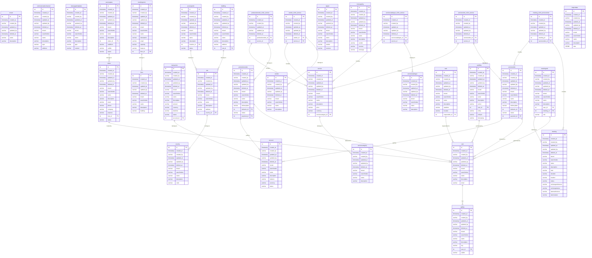

# Magic Meetings

Build with the help of Koksmat - check out https://chatgpt.com/g/g-0bOeHsx6y-koksmat-code-assistant

## Data model

```mermaid
erDiagram
    tenant {
        int id PK
        timestamp created_at
        varchar created_by
        timestamp updated_at
        varchar updated_by
        timestamp deleted_at
        varchar name
        varchar description
    }

    user {
        int id PK
        timestamp created_at
        varchar created_by
        timestamp updated_at
        varchar updated_by
        timestamp deleted_at
        varchar tenant
        varchar searchindex
        varchar name
        varchar description
        varchar email
    }

    apikey {
        int id PK
        timestamp created_at
        varchar created_by
        timestamp updated_at
        varchar updated_by
        timestamp deleted_at
        varchar tenant
        varchar searchindex
        varchar name
        varchar description
        varchar key
        int user_id FK
        varchar validto
    }

    communicationchannel {
        int id PK
        timestamp created_at
        varchar created_by
        timestamp updated_at
        varchar updated_by
        timestamp deleted_at
        varchar tenant
        varchar searchindex
        varchar name
        varchar description
        varchar type
        varchar address
    }

    messagetemplates {
        int id PK
        timestamp created_at
        varchar created_by
        timestamp updated_at
        varchar updated_by
        timestamp deleted_at
        varchar tenant
        varchar searchindex
        varchar name
        varchar description
        varchar type
        varchar content
    }

    country {
        int id PK
        timestamp created_at
        varchar created_by
        timestamp updated_at
        varchar updated_by
        timestamp deleted_at
        varchar tenant
        varchar searchindex
        varchar name
        varchar description
        varchar code
    }

    site {
        int id PK
        timestamp created_at
        varchar created_by
        timestamp updated_at
        varchar updated_by
        timestamp deleted_at
        varchar tenant
        varchar searchindex
        varchar name
        varchar description
        varchar address
        int country_id FK
    }

    building {
        int id PK
        timestamp created_at
        varchar created_by
        timestamp updated_at
        varchar updated_by
        timestamp deleted_at
        varchar tenant
        varchar searchindex
        varchar name
        varchar description
        varchar address
        int site_id FK
    }

    floor {
        int id PK
        timestamp created_at
        varchar created_by
        timestamp updated_at
        varchar updated_by
        timestamp deleted_at
        varchar tenant
        varchar searchindex
        varchar name
        varchar description
        varchar building
    }

    meetingroom {
        int id PK
        timestamp created_at
        varchar created_by
        timestamp updated_at
        varchar updated_by
        timestamp deleted_at
        varchar tenant
        varchar searchindex
        varchar name
        varchar description
        varchar email
        varchar capacity
        varchar features
        int floor_id FK
    }

    account {
        int id PK
        timestamp created_at
        varchar created_by
        timestamp updated_at
        varchar updated_by
        timestamp deleted_at
        varchar tenant
        varchar searchindex
        varchar name
        varchar description
        varchar balance
        varchar currency
        varchar status
    }

    transaction {
        int id PK
        timestamp created_at
        varchar created_by
        timestamp updated_at
        varchar updated_by
        timestamp deleted_at
        varchar tenant
        varchar searchindex
        varchar name
        varchar description
        varchar amount
        varchar currency
        varchar datetime
        varchar status
        int account_id FK
    }

    servicecategory {
        int id PK
        timestamp created_at
        varchar created_by
        timestamp updated_at
        varchar updated_by
        timestamp deleted_at
        varchar tenant
        varchar searchindex
        varchar name
        varchar description
    }

    service {
        int id PK
        timestamp created_at
        varchar created_by
        timestamp updated_at
        varchar updated_by
        timestamp deleted_at
        varchar tenant
        varchar searchindex
        varchar name
        varchar description
        varchar price
        varchar currency
        int servicecategory_id FK
    }

    servicecatalogue {
        int id PK
        timestamp created_at
        varchar created_by
        timestamp updated_at
        varchar updated_by
        timestamp deleted_at
        varchar tenant
        varchar searchindex
        varchar name
        varchar description
    }

    servicecatalogue_m2m_service {
        int id PK
        timestamp created_at
        varchar created_by
        timestamp updated_at
        varchar updated_by
        timestamp deleted_at
        int servicecatalogue_id FK
        int service_id FK
    }

    vendor {
        int id PK
        timestamp created_at
        varchar created_by
        timestamp updated_at
        varchar updated_by
        timestamp deleted_at
        varchar tenant
        varchar searchindex
        varchar name
        varchar description
    }

    vendor_m2m_service {
        int id PK
        timestamp created_at
        varchar created_by
        timestamp updated_at
        varchar updated_by
        timestamp deleted_at
        int vendor_id FK
        int service_id FK
    }

    serviceorder {
        int id PK
        timestamp created_at
        varchar created_by
        timestamp updated_at
        varchar updated_by
        timestamp deleted_at
        varchar tenant
        varchar searchindex
        varchar name
        varchar description
        varchar deliverydate
        int deliverto_id FK
        varchar status
        int payment_id FK
    }

    serviceorder_m2m_service {
        int id PK
        timestamp created_at
        varchar created_by
        timestamp updated_at
        varchar updated_by
        timestamp deleted_at
        int serviceorder_id FK
        int service_id FK
    }

    productionorder {
        int id PK
        timestamp created_at
        varchar created_by
        timestamp updated_at
        varchar updated_by
        timestamp deleted_at
        varchar tenant
        varchar searchindex
        varchar name
        varchar description
        varchar deliverydate
        int deliverto_id FK
        varchar status
        int payment_id FK
    }

    productionorder_m2m_service {
        int id PK
        timestamp created_at
        varchar created_by
        timestamp updated_at
        varchar updated_by
        timestamp deleted_at
        int productionorder_id FK
        int service_id FK
    }

    task {
        int id PK
        timestamp created_at
        varchar created_by
        timestamp updated_at
        varchar updated_by
        timestamp deleted_at
        varchar tenant
        varchar searchindex
        varchar name
        varchar description
        varchar starttime
        varchar location
        int responsible_id FK
    }

    signal {
        int id PK
        timestamp created_at
        varchar created_by
        timestamp updated_at
        varchar updated_by
        timestamp deleted_at
        varchar tenant
        varchar searchindex
        varchar name
        varchar description
        varchar sender
        varchar receiver
    }

    messagelog {
        int id PK
        timestamp created_at
        varchar created_by
        timestamp updated_at
        varchar updated_by
        timestamp deleted_at
        varchar tenant
        varchar searchindex
        varchar name
        varchar description
        varchar sender
        varchar receiver
        varchar message
    }

    auditlog {
        int id PK
        timestamp created_at
        varchar created_by
        timestamp updated_at
        varchar updated_by
        timestamp deleted_at
        varchar tenant
        varchar searchindex
        varchar name
        varchar description
        varchar action
        int user_id FK
        varchar entity
        varchar entityid
        varchar timestamp
    }

    visitor {
        int id PK
        timestamp created_at
        varchar created_by
        timestamp updated_at
        varchar updated_by
        timestamp deleted_at
        varchar tenant
        varchar searchindex
        varchar name
        varchar description
        varchar email
        varchar phone
        varchar company
        varchar purpose
        int host_id FK
        varchar status
    }

    accesspoint {
        int id PK
        timestamp created_at
        varchar created_by
        timestamp updated_at
        varchar updated_by
        timestamp deleted_at
        varchar tenant
        varchar searchindex
        varchar name
        varchar description
        int location_id FK
        varchar status
    }

    accesspass {
        int id PK
        timestamp created_at
        varchar created_by
        timestamp updated_at
        varchar updated_by
        timestamp deleted_at
        varchar tenant
        varchar searchindex
        varchar name
        varchar description
        int visitor_id FK
        varchar validfrom
        varchar validto
        varchar status
    }

    meeting {
        int id PK
        timestamp created_at
        varchar created_by
        timestamp updated_at
        varchar updated_by
        timestamp deleted_at
        varchar tenant
        varchar searchindex
        varchar name
        varchar description
        varchar start
        varchar duration
        varchar location
        varchar status
        varchar exchangereference
        varchar exchangestatus
        varchar teamsreference
        varchar teamsstatus
    }

    meeting_m2m_serviceorder {
        int id PK
        timestamp created_at
        varchar created_by
        timestamp updated_at
        varchar updated_by
        timestamp deleted_at
        int meeting_id FK
        int serviceorder_id FK
    }

    meetingrole {
        int id PK
        timestamp created_at
        varchar created_by
        timestamp updated_at
        varchar updated_by
        timestamp deleted_at
        varchar tenant
        varchar searchindex
        varchar name
        varchar description
        int user_id FK
        int meeting_id FK
        varchar role
    }

    importdata {
        int id PK
        timestamp created_at
        varchar created_by
        timestamp updated_at
        varchar updated_by
        timestamp deleted_at
        varchar tenant
        varchar searchindex
        varchar name
        varchar description
        JSONB data
    }

    user ||--o{ apikey : has
    site ||--o{ country : "belongs to"
    building ||--o{ site : "belongs to"
    meetingroom ||--o{ floor : "belongs to"
    transaction ||--o{ account : "belongs to"
    service ||--o{ servicecategory : "belongs to"
    servicecatalogue_m2m_service ||--o{ servicecatalogue : "belongs to"
    servicecatalogue_m2m_service ||--o{ service : "includes"
    vendor_m2m_service ||--o{ vendor : "belongs to"
    vendor_m2m_service ||--o{ service : "includes"
    serviceorder ||--o{ user : "delivered to"
    serviceorder ||--o{ account : "paid by"
    serviceorder_m2m_service ||--o{ serviceorder : "belongs to"
    serviceorder_m2m_service ||--o{ service : "includes"
    productionorder ||--o{ user : "delivered to"
    productionorder ||--o{ account : "paid by"
    productionorder_m2m_service ||--o{ productionorder : "belongs to"
    productionorder_m2m_service ||--o{ service : "includes"
    task ||--o{ user : "responsible for"
    auditlog ||--o{ user : "performed by"
    visitor ||--o{ user : "hosted by"
    accesspoint ||--o{ site : "located at"
    accesspass ||--o{ visitor : "belongs to"
    meeting_m2m_serviceorder ||--o{ meeting : "includes"
    meeting_m2m_serviceorder ||--o{ serviceorder : "includes"
    meetingrole ||--o{ user : "performed by"
    meetingrole ||--o{ meeting : "belongs to"

```
